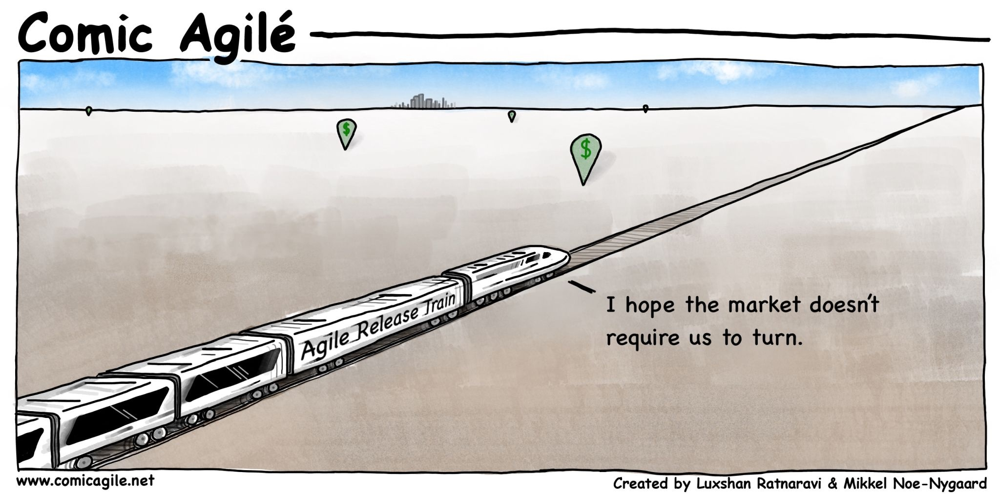

# Contentions with stuff like SAFe

[COLLECTION] [SAFe: A Collection Of Comments From Leading Experts](https://www.smharter.com/blog/safe-a-collection-of-comments-from-leading-experts/)
[Part Two](https://www.smharter.com/blog/safe-a-collection-of-comments-from-leading-experts-2/)

[Is SAFe safe? - Dave Farley](https://www.davefarley.net/?p=337)

[Beware SAFe (the Scaled Agile Framework for Enterprise), an Unholy Incarnation of Darkness - Sean Dexter](https://seandexter1.medium.com/beware-safe-the-scaled-agile-framework-for-enterprise-an-unholy-incarnation-of-darkness-bf6819f6943f)

[Issues with SAFe - Ron Jeffries](https://ronjeffries.com/xprog/articles/issues-with-safe/)

[Revenge of the PMO - Marty Cagan](https://svpg.com/revenge-of-the-pmo/)

[Scaling Agile FAQ - Marty Cagan](https://svpg.com/scaling-agile-faq/)

[In praise of SWARMing - Dan North](https://dannorth.net/2018/01/26/in-praise-of-swarming/)

[Why Safe Is Not the Scaled Agile Approach You Need - Agile Forest](https://agileforest.com/2018/06/24/why-safe-is-not-the-scaled-agile-approach-you-need/)

[SAFE BAD - 5 minute devops](https://bdfinst.medium.com/5-minute-devops-safe-isnt-6108f95bef23)

[SAFE is like the BORG](https://medium.com/serious-scrum/safe-is-like-the-borg-2f2048e7f504)
