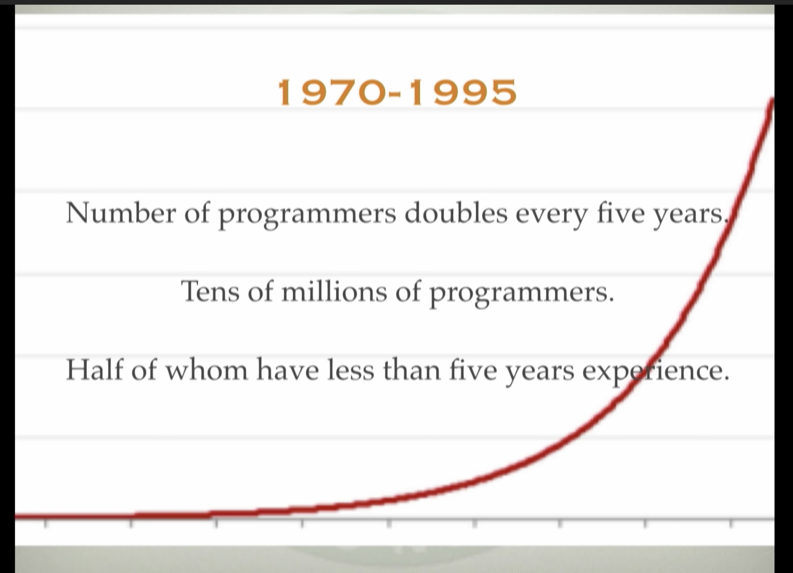

# Cog in a Wheel

Temasek Hall Alumni JumpsTHart 20220320

Some thoughts as a software engineer 3 years after graduation

Hi I am Joel! LYLC 18/19 NUS CS, 4 years in B Block, mainly involved in cultural and was 30th JCRC Cultural Director. After graduation at DBS I worked on an effort to consolidate APIs from multiple legacy systems. After which I spent more than a year at Circles.life and worked on backend services in the e-commerce domain. Currently I am at Thoughtworks as a Software Developer Consultant. I am passionate about uncovering better ways we work with software to deliver value and impact. Most fulfilling time of the journey thus far was establishing contact with senior leaders and trying to influence development practices and thought that are wider than individual day-to-day responsibilities.

## Agenda

1. The Macro
2. Growth
3. My Journey +Compensation
4. Community

# The Macro

## Seniors.length >>>> Juniors.length

# Growth

# Proverbs

## Building right thing vs Building thing right

- Product > Project
- Outcome > Output
- Mindset > skillset > toolset
- Principles > Practices > Tools

With $$ comes waste

## Economic Justifications for Practices

## Silos are inevitable

Cross-functional team

## People problem

## #ItDepends

# My Journey

Leetcode Medium

Hell pushed me to "Agile"

## Rookie Advice

### Metric #1 Deployment Frequency

Should have the capability to deploy

Keep Going Places Deployment Frequency

## Where School Falls Short

[MIT - Missing Semester](https://missing.csail.mit.edu/)

[https://github.com/nushackers/notes-to-cs-freshmen-from-the-future]()
# Community

Eric
- Shopee

Zhi Ming
- 

Jun Quan
- ex-Thoughtworks

Myself

- Ask me any questions

# Cog in a Wheel

Not a happy metaphor

- Small cog, big wheel
- Good cog, lousy wheel
- Your place in the organisation
- Your impact in the world
- Self-fulfillment